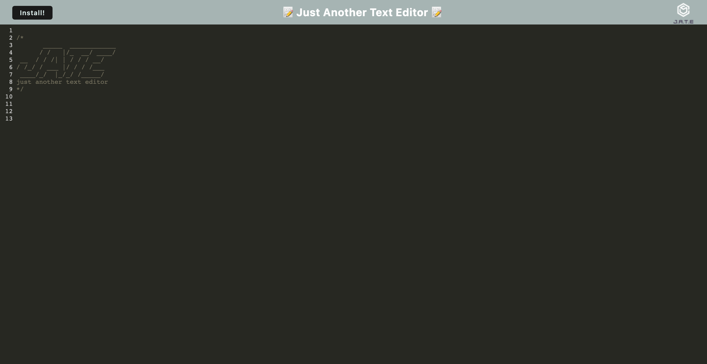

# PWA Text Editor


## Description

PWA's - a web application that behaves like a native app - work in a browser and are optimised to improve not just performance but user experience!

This week, to demonstrate a PWA, I have built a text editor (starting with an exisiting application) that runs in a web browser but can also be installed and used offline. 


## User Story

```md
AS A developer
I WANT to create notes or code snippets with or without an internet connection
SO THAT I can reliably retrieve them for later use
```


## Mock-Up

Below is a screenshot of the final text editor app!





The following gif demonstrates the application functionality:


To view the full deployed text editor or to download and install: [Just Another Text Editor](https://tranquil-waters-73039.herokuapp.com/)


## Credit


[Madeleine Cosway](https://github.com/madeleinesc)